Unser Ziel im Verlauf des CSS & UI Workshop war es, die Gestaltung unseres UI für unser Masterprojekt “Activise” auf das nächste Level zu bringen.

 “Activise” ist eine Applikation, welche als App oder als Website im Browser benutzt werden kann. Ziel ist es, Suchenden/Usern die Möglichkeit zu bieten, auf ihre Interessen abgestimmte Angebote zu finden und alle wichtigen Informationen im Überblick zu erhalten.  Ebenfalls soll die Kontaktaufnahme von Suchenden und Anbietern vereinfacht werden. Die App soll vor allem Personen ansprechen, welche ein neues Hobby suchen oder etwas Neues ausprobieren wollen. Es wird davon ausgegangen, dass diese Nutzergruppe die Website eher unterwegs am Smartphone bedient. Auf der anderen Seite sollen ebenfalls Anbieter, wie Vereine etc. angesprochen werden. Da die Verwaltung der Kurse und die Angabe nötiger Informationen aus Anbietersicht mehrere Eingaben erfordern, wird diese Nutzergruppe die Website eher auf einem Desktop-Gerät bedienen. Dadurch ergeben sich verschiedene Use Cases die auch in dem Design berücksichtigt werden müssen.


## Identifizierte Probleme

Während der Analyse unserer App hinsichtlich der UI-Prinzipien, sind folgende Probleme aufgetaucht:
* Zu geringe Kontraste im Dark/Light Mode
* Fehlende Zurück Buttons
* Fehlendes Mockup für Layout
* Rückmeldungen zu “Serveranfragen” (speichern, löschen) fehlen
* Inkonsistentes Styling von Formularen
* Klickbare Elemente teilweise nicht ersichtlich

Durch den CSS- & UI- Workshops wurden Lösungen für die Probleme bezüglich Kontrast, klickbare Elemente und Mockup erarbeitet und eine Vorher-Nachher Vergleich erstellt.

## Vorher-Nachher-Studie

Im Zuge des CSS-Workshops nahmen wir gezielt drei Issues aus unserem Issue Board in Angriff. 
In den folgenden Abschnitten wird näher darauf eingegangen, wie wir die Probleme gelöst haben, welche visuellen Verbesserungen im Vergleich zu vorher erreicht wurden und welche Lösungswege wir dahingehend angestrebt haben.

### Ausreichende Kontraste Dark/Light Mode

Unsere Analyse ergab, dass die aktuell verwendeten Farben nicht ausreichenden Kontrast bieten. Im Light Mode ist der Kontrast unserer Primärfarbe zu dem hellen Hintergrund nicht ausreichend, im Dark Mode war der Unterschied zwischen weißer Schrift und unserer Primärfarbe zu gering.

Unsere vorherige Kontrastprobleme:

") | ")
:---:|:---:
")
")

Um die Kontraste in unserer App für den [Dark](https://webaim.org/resources/linkcontrastchecker/?fcolor=FFFFFF&bcolor=121212&lcolor=80CBC4) und [Light](https://webaim.org/resources/linkcontrastchecker/?fcolor=000000&bcolor=FFFFFF&lcolor=80CBC4) Mode zu verbessern, wurde im ersten Schritt mit einem [Link-Contrast-Checker](https://webaim.org/resources/linkcontrastchecker/) die Benutzerfreundlichkeit und Zugänglichkeit unserer Farben für den Dark und Light Mode bewertet: 

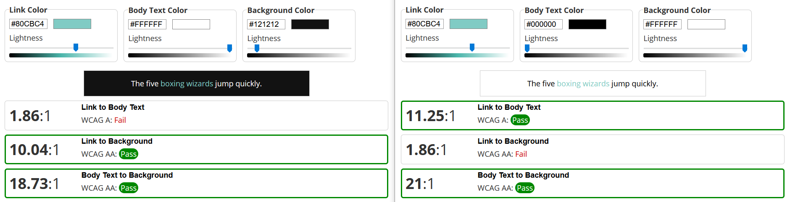

Da wir keine einheitliche Primärfarbe für Light und Dark Mode finden konnte, welche ausreichend Kontrast in beiden Modis gewährleistet, haben wir uns für eine Primärfarbe je Modi entschieden. Auf Basis des Link-Contrast-Checker wählten wir ähnliche Farbe, einen [dunkleren](https://webaim.org/resources/linkcontrastchecker/?fcolor=FFFFFF&bcolor=121212&lcolor=31948A) Wert des ursprünglichen Farbbereichs für den Light Mode und einen [helleren](https://webaim.org/resources/linkcontrastchecker/?fcolor=000000&bcolor=FFFFFF&lcolor=28776F) Wert für den Dark Mode, aus, die für die Lesbarkeit besser geeignet sind:

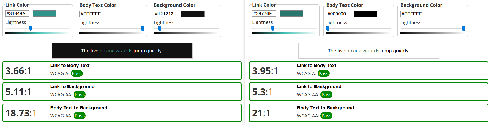

Die Farben in unserer App wurden anschließend mit den neue Farben ausgetauscht. Dafür wurden die Variablen für die Primary Color für den Dark und Light Mode ausgetauscht und mit den [Ionic Color Generator](https://ionicframework.com/docs/theming/colors) die Farbabwandlungen neu generiert:

```css
:root {
  --ion-color-primary: #28776F;
  --ion-color-primary-rgb: 40,119,111;
  --ion-color-primary-contrast: #ffffff;
  --ion-color-primary-contrast-rgb: 255, 255, 255;
  --ion-color-primary-shade: #236962;
  --ion-color-primary-tint: #3e857d;
}

body.dark {
  --ion-color-primary: #80CBC4;
  --ion-color-primary-rgb: 128,203,196;
  --ion-color-primary-contrast: #000000;
  --ion-color-primary-contrast-rgb: 0,0,0;
  --ion-color-primary-shade: #71b3ac;
  --ion-color-primary-tint: #8dd0ca;
}
```

Die Primary Color wurde dann für die Elemente mit schlechten Kontrast verwendet:

```jsx
<IonChip color="primary">
    <IonLabel>{p.category}</IonLabel>
</IonChip>
```

Durch die Anpassung der Farben in unsere App, wurde der Kontrast deutlich verbessert:

") | ")
:---:|:---:
")
")

### Hervorhebung von klickbaren Elementen

Ein weiteres Problem, welches aufgetaucht ist, stellt die unzureichende Erkennung der Call-To-Action Elemente dar:

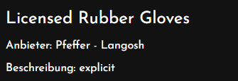
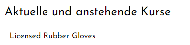

Um die Links visuell besser hervorzuheben, haben wir diese mit unserer zuvor während der Kontrastoptimierung neu erstellten Primary Color versehen:

```css
a {
  text-decoration: none;
  color: var(--ion-color-primary);
}
```

```jsx
<p>Anbieter: 
    <Link className="provider_link" to={`/providers/${course.provider.id}`}>
        {course.provider.name}
    </Link>
</p>
```

Danach waren die Links besser ersichtlich:

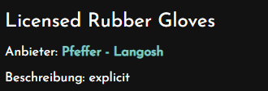
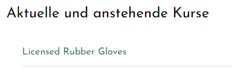

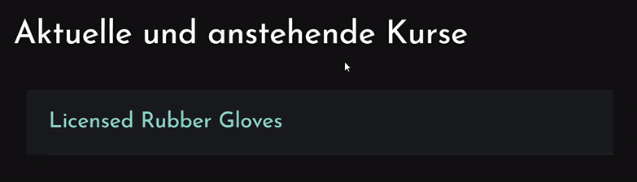

### Mockup

Unser erster Adobe XD Klick-Prototyp für unser erstes User-Testing im Dezember 2019 war noch auf die pure Funktionalität fokussiert und sollte uns helfen die Customer Needs und Pains zu ermitteln. Deshalb wurden hier weder Farben & Layout, noch Typographie oder andere Faktoren eines Beauty & Delight Ansatzes berücksichtigt.

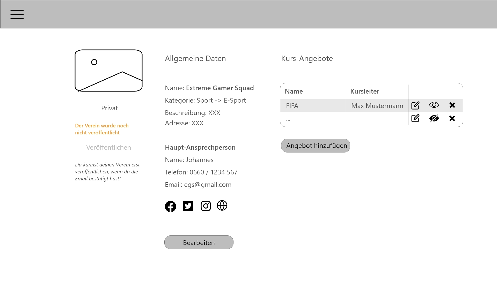

In unserer aktuellen Applikation in Development wurden bereits erste Grundsätze wie zum Beispiel die Farben und Kontraste (wie im vorherigen Kapitel beschrieben) umgesetzt.

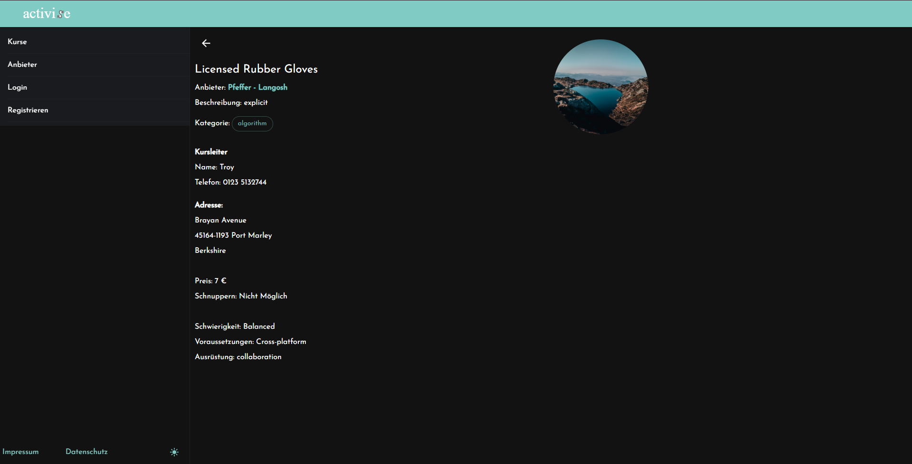

Das Layout und die genaue Anordnung der Elemente sowie eine einheitliche Form unserer Formulare und Profile wurden bis jetzt noch gar nicht berücksichtigt, da wir zuerst ein grobes Setup und die Auslieferung der Daten realisieren wollten. Im nächsten Schritt legten wir nun Mockups unter berücksichtigung des Beauty & Delight Ansatzes an, auf die in den folgenden Absätzen noch näher eingegangen wird.

#### Profil

Bei der Gestaltung der Profilseite eines Kursanbieters haben wir darauf geachtet, die für den User am relevantesten Infos so zu platzieren, dass sie auf einen Blick erfasst werden können, ohne dass der User von der Masse an Informationen erschlagen wird. Die Kategorien, die wir bereits als farblich hinterlegte Labels von der Übersichtsseite kennen, wurden hier wiederverwendet, um die Konsistenz unserer Webanwendung zu erhöhen. Größere Blöcke an zusammengehörigen Informationen werden auch visuell als solche dargestellt - in diesem Fall die Kontaktdaten der Ansprechperson und die Adresse, die über eine Toggle-Button zu einer Google-Maps-Ansicht wechselt.

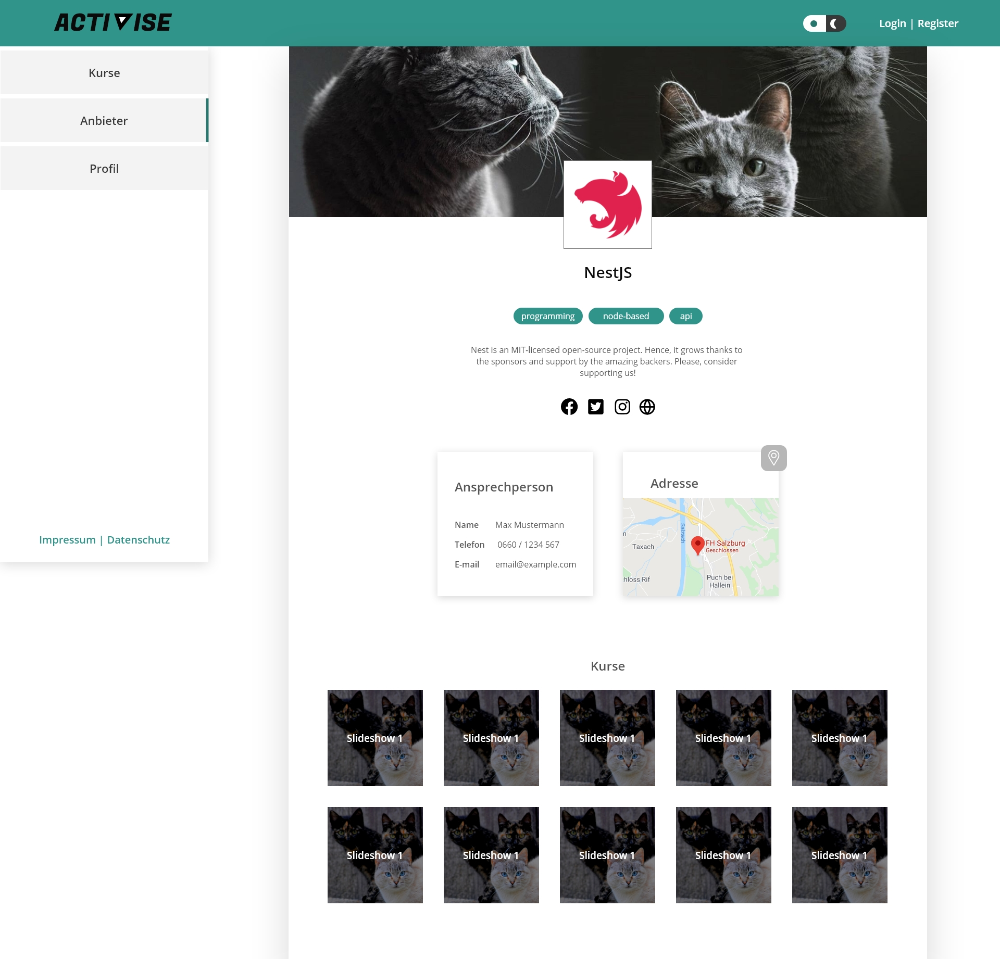

#### Formular

Bei dem Registrierformular für den Kursanbieter, der verhältnismäßig mehr Daten angeben muss als der normale Durchschnittsuser,  haben wir uns für ein Multi-Step-Formular mit Visualisierung des Formular-Fortschritts in Form eines Balkens entschieden, um den User besser durch den Ausfüll-Prozess zu führen und um die Usability zu verbessern. Somit weiß der User immer genau, wo er sich gerade befindet und wie viele weitere Steps noch folgen.

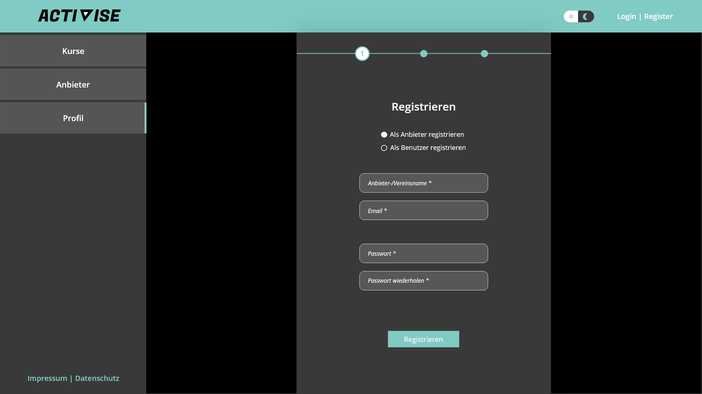

#### User Feedback

Ein erstes kurzes User Testing des neuen Klick-Prototyps hat ergeben, dass es hier noch kleinere Anpassungen der Kontraste im Bereich des neuen Registrier-Formulars benötigt. Sehr positiv wurde das schrittweise Durchführen durch den Registriervorgangs bewertet. Dadurch wurde die Navigation vereinfacht und der User fühlt sich weniger verloren.

Der Dark/Light Mode Button in der Navigation wurde als überflüssig bzw. deplatziert kommentiert, da die Systemeinstellungen vom User auf unserer Seite ohnehin übernommen werden. Deshalb haben wir uns dazu entschieden diesen Toggle auf einem weniger prominenten Platz zu platzieren und somit wurde dieser in den Settings auf der User-Profilseite verschoben.

")

")

")

## UI-Prinzipien

In Bezug auf die vier UI-Prinzipien **“Accessibility”**, **“Guidance & Hierarchy“**,  **“Responsive & Forgiving”** und **“Beauty & Delight”** konnten wir im Laufe des Workshops auch einige Fortschritte verzeichnen. 

In Punkto **“Accessibility”** stellten wir fest, dass beim aktuellen Stand des Prototypen gewisse Features noch nicht vollständig umgesetzt waren, allerdings noch nicht ausreichend als “Work in Progress” für unsere Tester gekennzeichnet waren. Dies sollte dem Nutzer in Zukunft klarer kommuniziert werden. Außerdem führten wir uns erneut vor Augen, in welcher Situation unsere zwei Usergruppen unsere Webanwendung auf welchem Device verwenden würden: Die Desktop-Ansicht ist in erster Linie für Anbieter gedacht, während die Mobil-Ansicht für die aktiven Mitglieder quasi “on the go” verfügbar sein sollte. Für eine bessere Lesbarkeit haben wir in diesem Kontext auch weitere Kontrastanpassungen bei unsere Links und Labels vorgenommen.

Hinsichtlich des Punktes **“Guidance & Hierarchy”** tauchte bei uns das Problem auf, dass hin und wieder Zurück-Buttons fehlen und dadurch für den User nicht klar ersichtlich ist, dass er wieder zurück navigieren kann. Ansonsten ist für den User klar verständlich, wo er sich gerade befindet, wo er hingehen kann und wo welche Informationen aufgefunden werden. Das wird vor allem dadurch unterstützt, dass wir für gleiche Elemente, wie zum Beispiel Buttons, immer ein konsistentes Design verwenden. Grundsätzlich sind auch ähnliche Seiten (wie die Kurs Detailansicht und die Anbieter Detailansicht) gleich aufgebaut um somit dem User eine Klarheit und Konsistenz in unserer App zu bieten. Auch der Punkt “Hierarchie und Wichtigkeit” wurde beachtet, indem unsere Informationen auf der Kurs-Detailansicht nach der Wichtigkeit für den User gereiht werden. Eher unwichtige Informationen werden somit weiter unten gereiht.

Bei unserer Analyse zum nächsten Prinzip **“Responsive & Forgiving”** stellten wir fest, dass unsere User noch wenig Rückmeldung zum Erfolg eines Bearbeitungs- oder Löschvorgangs erhalten. Deshalb erstellten wir sogleich ein Issue, um sogenannte “Empty States” zu vermeiden, indem wir entsprechend aufbereitet und visuell eindeutig gestaltete Server Responses einfügen. So soll der Status der Webapp für den User zu jeder Zeit nachvollziehbar sein. Es soll dem User auch möglich sein, gewisse Schritte rückgängig zu machen. Eventuelle Sackgassen wollen wir demnach mit “Undo”-Buttons realisieren.

Beim letzten Punkt **“Beauty & Delight”** haben wir unseren ersten Prototyp noch einmal komplett überarbeitet und ein großes Augenmerk auf eine einheitliche Farbwahl mit ausreichend Kontrast gelegt. Ein harmonisches Gesamtbild soll im 3. Semester des Masters erreicht werden, wenn das Logo von einer oder einem unserer Kolleginnnen/Kollegen des Partnerstudiengangs MMA überarbeitet wird. In Zuge dessen können ebenfalls Änderungen der Typographie für die Überschriften und den Fließtext erfolgen.

## Benutzte Technologien hinsichtlich UI

### Ionic Framework

Wir verwenden [Ionic](https://ionicframework.com/) als Framework. Dieses bietet bereits fertige [UI-Komponenten](https://ionicframework.com/docs/components), welche sich (je nach Endgerät) an das Material- bzw. iOS-Design orientieren. Zusätzlich bietet das Framework die Möglichkeit, Variablen des Themes nach Bedarf zu überschreiben (siehe [Ionic Theming Basics](https://ionicframework.com/docs/theming/basics)).

### Ionic Color Creator

Ionic hat neun Standardfarben, mit denen die Farbe vieler Komponenten geändert werden kann. Jede Farbe ist eigentlich eine Sammlung mehrerer Eigenschaften: Base-Color, Kontrast, Farbton und Tönung. Die Basis- und Kontrastfarben erfordern auch eine RGB-Eigenschaft, die dieselbe Farbe nur im RGB-Format ist. Diese Sammlung kann auf der [Ionic Colors](https://ionicframework.com/docs/theming/colors)-Seite mit einen beliebigen HEX-Code genieriert werden.

In unserem Projekt haben wir uns gegen die von Ionic vorgeschlagenen Standardfarben entschieden und diese mit anderen Farbwerten überschrieben (siehe Codebeispiele). 

### Link Contrast Checker

Der [Link Contrast Checker](https://webaim.org/resources/linkcontrastchecker/) von WebAIM erleichtert Designer und Developer einen ausreichenden Kontrast zwischen Hintergrundfarbe und Textfarbe für ihr Projekt zu ermitteln und anzuwenden.

## Ausblick

Aktuell befinden sich in unserem Issues-Board folgende Issues mit dem Tag **CSS UI**, bei denen wir noch über weitere Umsetzungsmöglichkeiten diskutieren müssen.

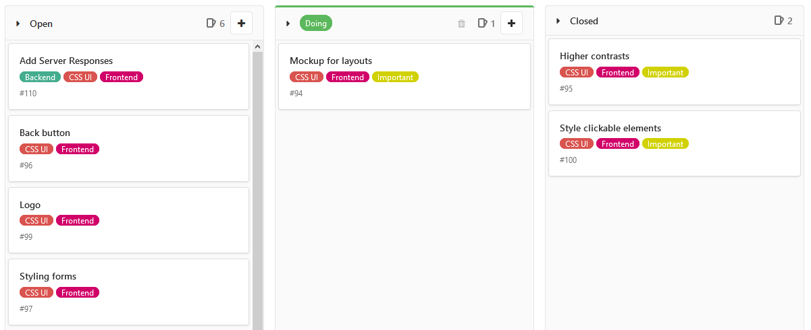

Ein perfektes UI-Design existiert nicht. Es wird immer Raum für Verbesserungen geben, so auch in diesem Projekt. 

## Quellen
https://webaim.org/

https://ionicframework.com/docs/theming/colors

https://ionicframework.com/

https://www.w3.org/WAI/standards-guidelines/wcag/

https://developer.mozilla.org/en-US/docs/Web/CSS/@media/prefers-color-scheme


---

**Activise** ist das Masterprojekt für den Studiengang MultiMediaTechnology an der Fachhochschule Salzburg von Isabella, Julia, Lisa-Maria und Kevin.
