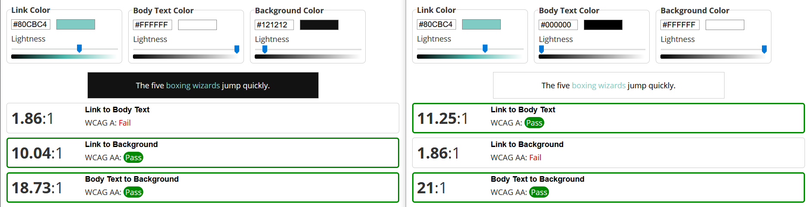

Unser Ziel im Verlauf des CSS & UI Workshop war es, die Gestaltung unseres UI für unser Masterprojekt “Activise” auf das nächste Level zu bringen.

## Identifizierte Probleme

Während der Analyse unserer App hinsichtlich der UI-Prinzipien, sind folgende Probleme aufgetaucht:
* Zu geringe Kontraste im Dark/Light Mode
* Fehlende Zurück Buttons
* Fehlendes Mockup für Layout
* Rückmeldungen zu “Serveranfragen” (speichern, löschen) fehlen
* Inkonsistentes Styling von Formularen
* Klickbare Elemente teilweise nicht ersichtlich

Durch den CSS- & UI- Workshops wurden Lösungen für die Probleme bezüglich Kontrast, Klickbare Elemente und Mockup erarbeitet.

## Vorher-Nachher-Studie

### Ausreichende Kontraste Dark/Light Mode

Unsere Analyse ergab, dass die aktuell verwendeten Farben nicht ausreichenden Kontrast bieten. Im Light Mode ist der Kontrast unserer Primärfarbe zu dem hellen Hintergrund nicht ausreichend, im Dark Mode war der Unterschied zwischen weißer Schrift und unserer Primärfarbe zu gering.

Unsere vorherige Kontrastprobleme:

**IMAGES** 

Um die Kontraste in unserer App für den [Dark](https://webaim.org/resources/linkcontrastchecker/?fcolor=FFFFFF&bcolor=121212&lcolor=80CBC4) und [Light](https://webaim.org/resources/linkcontrastchecker/?fcolor=000000&bcolor=FFFFFF&lcolor=80CBC4) Mode zu verbessern, wurde im ersten Schritt mit einem [Link-Contrast-Checker](https://webaim.org/resources/linkcontrastchecker/) die Benutzerfreundlichkeit und Zugänglichkeit unserer Farben für den Dark und Light Mode bewertet: 



Da wir keine einheitliche Primärfarbe für Light und Dark Mode finden konnte, welche ausreichend Kontrast in beiden Modis gewährleistet, haben wir uns für eine Primärfarbe je Modi entschieden. Auf Basis des Link-Contrast-Checker wählten wir ähnliche Farbe, einen dunkleren Wert des ursprünglichen Farb Bereichs für den Light Mode und einen helleren Wert für den Dark Mode, aus, die für die Lesbarkeit besser geeignet sind:

**IMAGES**

Die Farben in unserer App wurden anschließend mit den neue Farben ausgetauscht. Dafür wurden die Variablen für die Primary Color für den Dark und Light Mode ausgetauscht und mit den [Ionic Color Generator](https://ionicframework.com/docs/theming/colors) die Farbabwandlungen neu generiert:

```css
:root {
  --ion-color-primary: #28776F;
  --ion-color-primary-rgb: 40,119,111;
  --ion-color-primary-contrast: #ffffff;
  --ion-color-primary-contrast-rgb: 255, 255, 255;
  --ion-color-primary-shade: #236962;
  --ion-color-primary-tint: #3e857d;
}

body.dark {
  --ion-color-primary: #80CBC4;
  --ion-color-primary-rgb: 128,203,196;
  --ion-color-primary-contrast: #000000;
  --ion-color-primary-contrast-rgb: 0,0,0;
  --ion-color-primary-shade: #71b3ac;
  --ion-color-primary-tint: #8dd0ca;
}
```

Die Primary Color wurde dann für die Elemente mit schlechten Kontrast verwendet:

```jsx
<IonChip color="primary">
    <IonLabel>{p.category}</IonLabel>
</IonChip>
```

Nachdem die Farben in unsere App angepasst wurden, wurde der Kontrast deutlich verbessert:

**IMAGES**