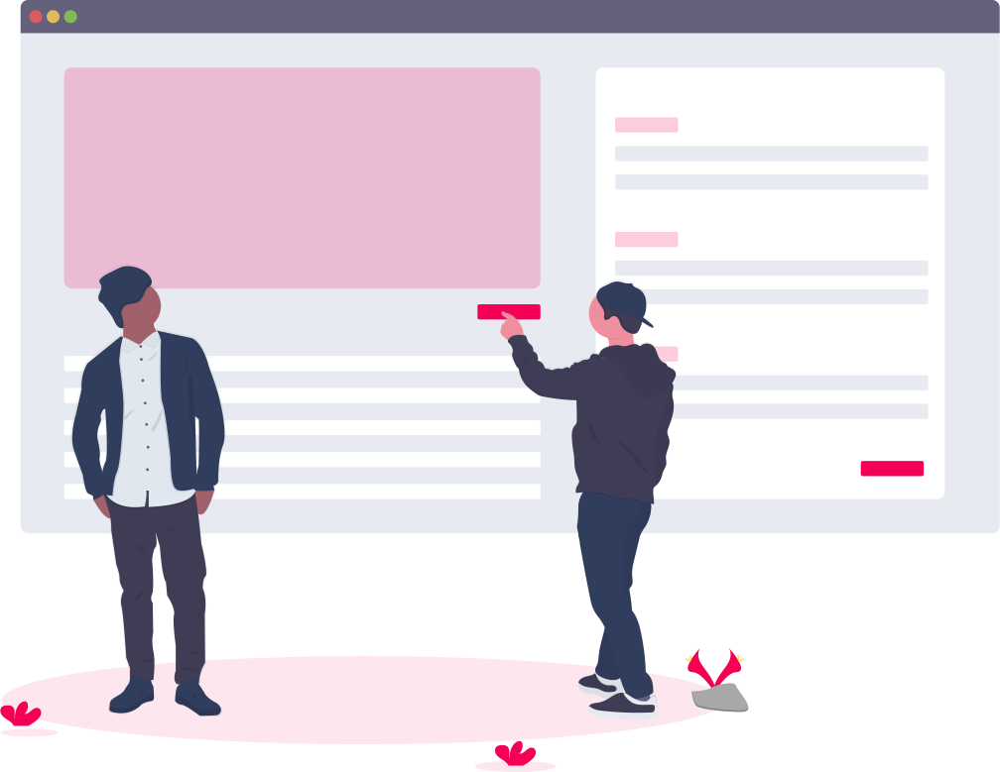

Since I have to make a "creative" documentation of my 2020 summer semester and *Advanced HCI* lecture experiences, I thought this could be a chance to get some experience in blog post writing and maybe I will mark this post as public eventually.

## Lecture & Professor

My **Advanced HCI: Methods & Applications** Professor once said, his lecture can be described with the **[Serial Position Effect](https://lawsofux.com/serial-position-effect.html)**:

> Users have a propensity to best remember the first and last items in a series.

This UX law has a point, because I can remember our first lecture with a really motivated professor (who happened to teach at my previous university but in another program as well) who wants to help us with all his knowledge and I can remember our last lecture where I did one of the easiest online tests until now.

But I still remember some parts in between of these two lectures which will blur eventually. These memories contain several online lecture issues (bad connection, sound sharing issues, and other setup troubles) and a professor that often strayed from the subject. Don't get me wrong, he is a nice guy who knows a lot in his subject but tends to overstate the case and misinterprets short project descriptions such as our Master's projects because of his wide domain knowledge. This can be both helpful and frustrating when you ask a question and don't have the feeling that the question was answered in the end.

Furthermore I think this lecture was one semester too early in our curriculum, since it would be helpful for our Master's thesis but in the current sate nobody has a thesis topic yet. Fortunately our professor reacted quick to this issue and adapted his topics from thesis to our projects.

## Learning during a Global Pandemic

So, what was it like to be part of a semester during the *Covid-19* pandemic?

Honestly, the way how I was studying didn't change at all. I attended my lectures, there was homework to do, I procrastinated, the same as usual. 

The only things that really changed were:
* I didn't have to waste 4 hours a week for commute to the dorm.
* I could attend lectures while I was in bed.
* My girlfriend brought breakfast during lectures.

So yeah, everything worked out better than expected. Online lectures, homework, the Master's project, even exams, nothing changed at all because we still had enough to do.

## Exam preparation

Next stop: When do I usually learn the most during a lecture? About 1 to 3 days before the exam.

This is the time where I have to figure out how to schedule all the topics in the short time range of days between my exams. In case of *Advanced HCI* I had 3 minus 1 (where I did some work for the Master's project and some other assignments) days to learn 153 + 22 slides. Compared to my glorious days as a Bachelor's student were I managed to learn about 700 slides within 24 hours and a huge lack of sleep, those were rookie numbers. Furthermore the HCI exam was open book and digital, so I could easily look up everything from the slides. But still, when there are slides, I'm going to read every slide at least once before I take the exam. But when I read slides, do I really pay attention to them like I should? The answer is no. I always manage to zone out during studying and think about all my project ideas or create new ones. But there are rare occasions where I am able to use some topics on the slides for my private projects, like it was during my HCI exam preparation. 

## Private project testing ideas

Will I ever have the time or money to use most of the methods I learned in both lectures *Advanced HCI* and *Usability Engineering* in a real working environment? Probably no. But this doesn't mean I can't include them in my personal projects.

Without talking about the content of my future project, I want to share some considerations about HCI methods I could use for it here:

1. Develop a potential releasable prototype.
2. Start a closed alpha with some friends which are familiar with the domain of the project and let these friends invite 1 or 2 friends of them too to get more opinions and reduce biases.
3. Get to know the testers with a non-anonymous survey for information like their hardware, preferred communication medium and their IT skills.
4. Create a communication channel (Discord, Slack, ...) with the testers for feedback, one-on-one interviews and news.
5. Let testers perform tasks on the project and ask them to fill out a survey afterwards.
6. Occasionally observe some testers during the tasks and ask them for think aloud feedback.
7. Take the feedback into consideration and implement it for a new iteration.
8. Repeat this cycle a few times with new or improved features.
9. Present the project to potential partners and shareholder.
10. Prepare for the release.
11. Finally release it.
12. Make the users happy.

## Wrap-up

My final words about this semester: *I'm so done with it!*

It was once again a semester with some boring lectures, stressful, not enough time to focus on our Master's project, and enough reasons to complain about my university like bad organization, communication, and missing Windows support. As I write, this semester is not over yet with one presentation and 6 assignments (including this one) to submit within the next two weeks, but at least exams are over. I'm so ready for some days to relax and hopefully some qualitative time with friends before my summer job begins, I continue working on my Master's project, and finally start with one of my personal projects (so many projects...) together with my girlfriend. It seems like the stressful times won't end anytime soon, but hopefully it will all pay off in the end.

---

Those **beautiful illustrations** I use in this post are from [unDraw](https://undraw.co) and they really help to give the whole post a nice touch.